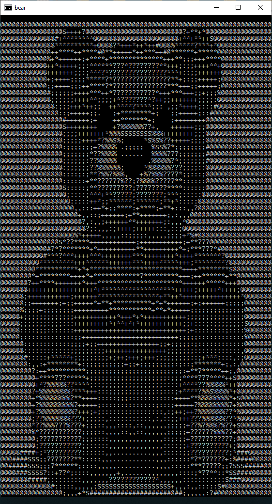
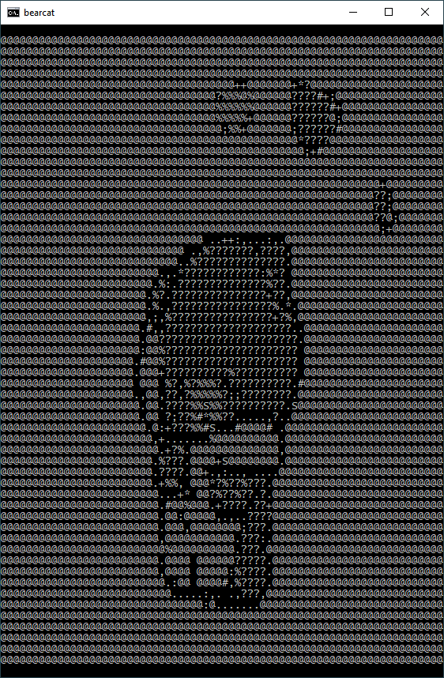
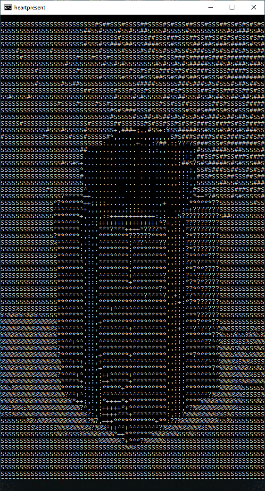

# asciify

Fun python utility that converts .gif images into windows batch ASCII-art animations.

It takes a single .gif image such as [this one](./examples/bear.gif), rescales it into a much smaller resolution so that it can fit into a console window, and then converts the image to ASCII art based on the color intensity at each pixel. This is done for every frame of the gif animation. 

A windows batch script file is generated to display the ASCIIfied frames in a loop - effectively converting the gif animation into a console ASCII-art animation. This works pretty well for simple gif files with very distinct colors, like the examples below.

## Examples

input | output
----- | ------
 | 
 | 
 | 

<br/>

## Requirements

- python 3 (tested on 3.7.3)
- [PIL library](https://pillow.readthedocs.io/en/stable/) (tested on 5.4.1)
- the batch scripts will work on Windows 10 **ONLY**

## Usage

```bash
# install-dependancies
$ pip install pillow

# run
$ python3 asciify.py [gif-file]

# custom animation size
$ python3 asciify.py [gif-file] [width-in-characters]
```

## How it works

Getting an animation running smoothly in batch is harder than I initially thought, although some obscure [ANSII escape codes](https://en.wikipedia.org/wiki/ANSI_escape_code) help this a great deal.

Each line of text is simply `echo`ed out to the console in sequence, however dealing with frame boundaries is a bit more complicated, as simply `clear`ing the previous frame from the console makes the animation flicker unbearably. A much better looking solution is to not clear the previous frame at all but to simply overwrite it one character at a time. Between each frame, the `ESC[H` escape code will place the console cursor in the very top-left of the screen so that the next frame will start overwritting the last one. This completely eliminates flickering.

Without any delay between frames the batch animation can run much much faster than the gif animation it is created from. To work around this I added a small delay between each frame by calling `ping localhost -n 1 >nul`. This ping won't do anything and will add only a tiny delay between frames.

I use the `ESC[?25l` command to disable the console cursor so that it doesn't interfere with the actual animation. A lot of care must also be taken not to accidentaly write more lines to the console than the size of the console buffer - because this will make the animation appear very jittery.

## Limitations

Currently, the output is a black-and-white ASCII-art animation, and colored output is not supported. Windows 10 does support [ANSII escape codes](https://en.wikipedia.org/wiki/ANSI_escape_code#Colors) that change the color of the console output, and it wouldn't be too dificult to modify the output to include these, however I decided to stick with this simpler black-and-white approach.

The output is always a batch script, which is only usable on windows. The [asciify.py](./asciify.py) could be modified to output bash script or something similar to get this working on linux - but I only needed this to run on windows so I never bothered.

When a gif image is bigger in the vertical direction (when it is tall rather than wide) then the batch file generated from it might not display properly. This is because windows 10 cannot open a console window with an arbitrary size, for whatever reason it seems like the biggest possible height is 90 characters - so if the output from [asciify.py](./asciify.py) exceeds this you might have to lower the character with of the image (see usage).

Only one gif file can be processed at a time.

## Licence

This software is in the public domain - you can do whatever you want with it.
